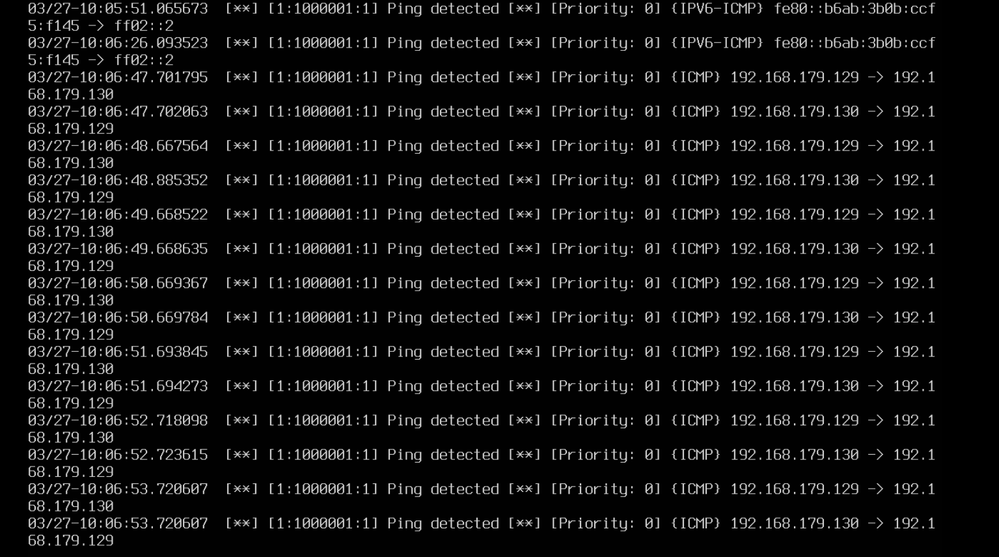
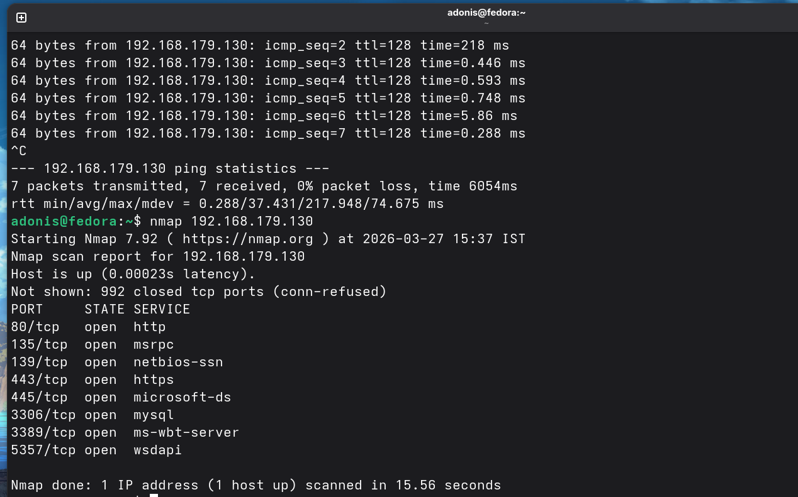
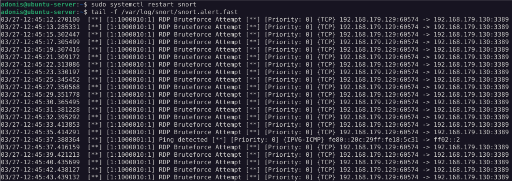
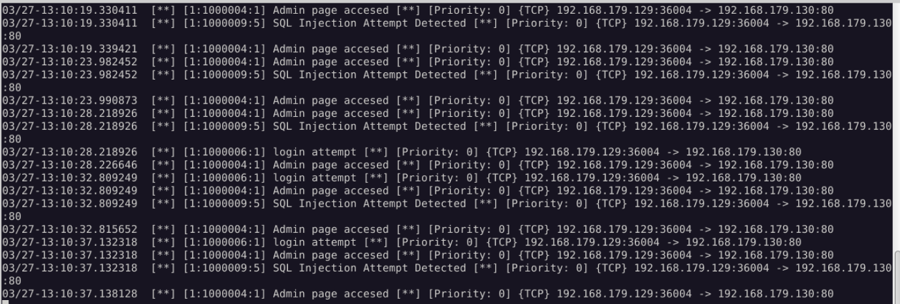

# 🔐 Snort IDS Lab – Intrusion Detection System

## 📌 Overview
In this project, I built a small lab to understand how an Intrusion Detection System (IDS) works in a real-world scenario. I used Snort to monitor network traffic and detect different types of attacks in a controlled virtual environment.

---
## 🧠 Lab Architecture


## ⚙️ Lab Setup
I created a virtual lab using VMware with three machines:

- Ubuntu Server – running Snort as the IDS  
- Windows 10 – acting as the victim (web + RDP services)  
- Fedora Linux – used as the attacker machine  

This setup helped me simulate real attack traffic and observe how Snort detects it.

---

## 🛠️ Snort Setup (Summary)
Snort was installed and configured on an Ubuntu Server to function as a network-based Intrusion Detection System (IDS).

**Installation:**
```bash
sudo apt update
sudo apt install snort -y
```
- Configured `/etc/snort/snort.conf`  
- Set `HOME_NET` to match my lab network  
- Selected the correct interface (`ens34`)  
- Added custom rules in `/etc/snort/rules/local.rules`  

**To run Snort:**
```bash
sudo snort -A console -q -c /etc/snort/snort.conf -i ens34
```
**To monitor alerts in real time:**
```bash
tail -f /var/log/snort/snort.alert.fast
```
**🚀 Attacks I Simulated**

To test the IDS, I performed several common attack scenarios:

ICMP Ping (to discover live hosts)
Nmap SYN Scan (to find open ports)
RDP Brute Force attempts
HTTP admin/login access attempts
SQL Injection patterns
## 📜 Detection Rules

In this project, I created custom Snort rules to detect different types of attacks such as network scanning, brute-force attempts, and web-based attacks.

### 🔹 ICMP Detection (Ping)
Detects ICMP echo requests used for host discovery.
```snort
alert icmp any any -> $HOME_NET any (msg:"ICMP Ping detected"; sid:1000001; rev:1;)
```

### 🔹 SYN Scan Detection (Nmap)
Detects TCP SYN packets commonly used in Nmap port scanning.
```snort
alert tcp any any -> $HOME_NET any (flags:S; msg:"SYN Scan detected"; sid:1000002; rev:1;)
```
### 🔹 RDP Brute Force Detection
Detects repeated connection attempts to RDP service (port 3389).
```snort
alert tcp any any -> $HOME_NET 3389 (msg:"RDP Brute Force Attempt"; sid:1000003; rev:1;)
```
### 🔹 HTTP Admin Access Detection
Detects attempts to access sensitive admin endpoints.
```snort
alert tcp any any -> $HOME_NET 80 (content:"/admin"; msg:"Admin access attempt"; sid:1000004; rev:1;)
```
### 🔹 SQL Injection Detection
Detects common SQL injection patterns in web requests.
```snort
alert tcp any any -> $HOME_NET 80 (content:"' OR 1=1"; msg:"SQL Injection attempt"; sid:1000005; rev:1;)
```

### 📊 Results

Snort successfully detected all the simulated attacks and generated alerts in real time. This helped me understand how traffic is analyzed and how alerts are triggered in a SOC environment.

📷 Screenshots

I’ve included screenshots of:

## 📷 Screenshots

### ICMP Ping Detection


### Nmap SYN Scan Detection


### RDP Brute Force Detection


### SQL Injection Detection


👉 Check the /screenshots folder

## 📄 Full Report

You can view the complete project report here:
👉 [Open Full Project Report](docs/snort_lab.pdf)

🎯 What I Learned
How network traffic behaves (TCP/IP basics)
How to configure and run Snort
Writing and testing detection rules
Identifying attack patterns
Basic SOC-style monitoring and analysis

## ✅ Conclusion

This project helped me understand how an Intrusion Detection System works in a real-world scenario. By building a lab and simulating attacks like Nmap scans, brute-force attempts, and SQL injection, I was able to observe how Snort analyzes network traffic and generates alerts.

It gave me hands-on experience in configuring an IDS, writing detection rules, and monitoring logs — which are essential skills in a SOC environment.
